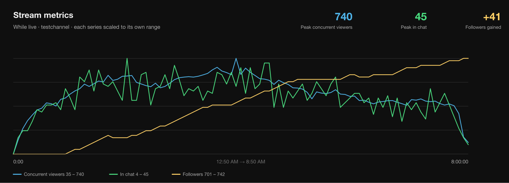

# Twitch Viewer Count Poller

Records the live viewer count for a Twitch channel into a CSV file on a fixed
interval, then charts it in the style of the YouTube Studio "Concurrent
viewers" graph.

**Python 3, standard library only — nothing to install.** No matplotlib, no
numpy, no `pip install`.


*Generated from the sample data committed to this repo. The header carries the
peak, **when** the peak happened, and the average; the amber segments are
per-30-minute averages.*

Polling all three metrics gives a panel each:


### What it does

- Polls the Twitch Helix API on an interval and appends one CSV row per sample
- Records viewers, followers and chat size together, or viewers alone
- Records offline polls too, so a gap in the data means "not running" rather than "not streaming"
- Handles token refresh, rate limits, outages and network loss without dying
- Keeps each channel in its own files, so several can be polled at once
- Charts any broadcast as a self-contained SVG — one metric or all three
- Ships synthetic sample data so you can try the chart before collecting anything

## Setup

Run this and follow the prompts:

```
python3 setup.py
```

It prints the instructions below, offers to open the Twitch dev console in your
browser, asks for the two values, **verifies them against the real API**, and
writes `.env` for you. If Twitch rejects them, nothing is written and it tells
you why — so you can't end up with a silently broken config.

### What you'll do in the browser

Twitch has no API for creating an app or reading back a secret, so this part is
manual — once, about two minutes.

1. Go to <https://dev.twitch.tv/console/apps/create> and log in.
   Twitch requires 2FA on the account to use the dev console; if you don't have
   it enabled it will make you set it up first (Settings -> Security).

2. Fill in the form:

   | Field | Value |
   |---|---|
   | **Name** | Anything unique across all of Twitch, e.g. `ign-viewer-log`. If it says the name is taken, add a number. |
   | **OAuth Redirect URLs** | `http://localhost:3000` — a required field, but this app never uses it. There's no browser redirect in the flow we use. |
   | **Category** | `Analytics Tool` |
   | **Client Type** | `Confidential` |

3. Click **Create**. You're back at the app list.

4. Click **Manage** next to your new app.

5. **Client ID** is on that page — copy it.

6. Click **New Secret**, confirm, and copy the **Client Secret** immediately.
   It is shown only once. If you lose it, click New Secret again — note that
   this invalidates the previous secret.

Then paste both into the `setup.py` prompt. The secret is typed hidden and is
never echoed to your terminal scrollback.

### Doing it by hand instead

If you'd rather skip the script, copy the template and fill it in:

```
cp .env.example .env
```

Or pass the values directly:

```
python3 setup.py --client-id XXXX --client-secret YYYY
```

No user login or OAuth scopes are needed — live stream data is public, so this
uses the server-to-server client credentials grant.

## Usage

The channel is the first argument. Each channel keeps its own data files, so
you can poll several at once from separate terminals.

```
python3 twitch_viewers.py ign   # poll ign
python3 twitch_viewers.py       # poll the default channel
```

`Ctrl-C` to stop. The terminal must stay open for polling to continue.

A single poll, useful for checking things work:

```
python3 twitch_viewers.py ign --once
```

`--channel ign` also works if you prefer the flag form.

### Setting a default channel

Without an argument it polls `DEFAULT_CHANNEL` from the top of
`twitch_viewers.py`. To change that without editing code, add to `.env`:

```
TWITCH_CHANNEL=ign
```

Precedence: **command line > `TWITCH_CHANNEL` > `DEFAULT_CHANNEL`**.

### Polling interval

`INTERVAL_SECONDS` at the top of `twitch_viewers.py` (currently 300 = 5
minutes). Polls land on wall-clock boundaries, so 300 gives you :00, :05, :10.
Twitch's rate limit is 800 points/minute — an enormous amount of headroom, so
polling more often is fine.

## Files

| File | Purpose |
|---|---|
| `setup.py` | One-time credential setup and verification |
| `twitch_viewers.py` | The poller |
| `metrics.py` | Polls viewers, followers and chat size together |
| `graph.py` | Charts the collected data as an SVG |
| `user_info.py` | Account details for one or more logins |
| `followers.py` | Follower count, list, and follow checks |
| `chatters.py` | How many people are connected to chat |
| `user_auth.py` | Browser login for endpoints needing a user token |
| `make_test_data.py` | Generates realistic fake data for testing the chart |
| `.env` | Your credentials (gitignored, mode 0600) |
| `.user_token.json` | User access token, if authorized (gitignored, mode 0600) |
| `viewers_<channel>.csv` | Viewer data from `twitch_viewers.py` |
| `metrics_<channel>.csv` | All three metrics from `metrics.py` |
| `poll_<channel>.log` | Status line history, one file per channel |
| `chart_<channel>.svg` | Generated chart |
| `.token_cache.json` | Cached app token, shared across channels |

Channel names are lowercased for filenames, so `ign` write to the
same `viewers_ign.csv` rather than splitting your data across two files.

## Output

**`viewers_<channel>.csv`** — one row per poll:

```
timestamp_utc,is_live,viewer_count,title,game,started_at,stream_id
2026-08-21T17:09:52Z,true,176,CODNext Showcase 2026,Special Events,2026-08-21T15:28:54Z,318926150999
2026-08-21T17:14:52Z,true,181,CODNext Showcase 2026,Special Events,2026-08-21T15:28:54Z,318926150999
2026-08-21T17:19:52Z,false,,,,,
```

Offline polls are recorded as rows with `is_live=false`, so a *gap* in the data
means the script wasn't running, not that the channel was off.

`stream_id` changes between broadcasts — use it to group samples into distinct
stream sessions.

**`poll_<channel>.log`** — the same status lines printed to the console, for
checking on a long run after the fact.

## Polling all three metrics

`twitch_viewers.py` records viewers only. `metrics.py` records viewers,
followers and chat size on the same tick, into one CSV:

```
python3 metrics.py themeparkgiant
python3 metrics.py themeparkgiant --once
python3 metrics.py ign --no-chatters
```

```
themeparkgiant  LIVE     viewers      51  followers      751  chat     4
```

Columns are `timestamp_utc, is_live, viewer_count, follower_count,
chatter_count, title, game, started_at, stream_id`, written to
`metrics_<channel>.csv`.

Followers and chat size are recorded **even when the channel is offline** —
people follow and bots sit in chat between streams — while `viewer_count` is
blank. Only `is_live` marks a broadcast.

### What each metric needs

| Metric | Token | Works for |
|---|---|---|
| Viewers | app | any channel |
| Followers | app | any channel |
| Chat size | user + `moderator:read:chatters` | channels you moderate |

Chat size is the only one that needs a browser login, so it degrades rather
than blocking: without a usable token, or on a channel you don't moderate, the
column is left blank and the other two carry on. `--no-chatters` skips it
outright. If chat requests fail three times running it stops asking, so a
permission change mid-run doesn't fill the log with errors.

## Graphing

```
python3 graph.py IGN --open
```

Reads `viewers_<channel>.csv` and writes `chart_<channel>.svg`, styled after the
YouTube Studio "Concurrent viewers" chart: peak and average in the header, a
filled area curve, gridlines, and elapsed time along the bottom.

It also prints a text summary with a per-block breakdown, so you get the numbers
without opening the chart.

Pure standard library — no matplotlib, no numpy. SVG opens in any browser and
stays sharp at any size.

### Peak timing

The header shows **when** the peak happened, both as elapsed stream time and as
a wall-clock time (`at 3:10:00 · 4:00 AM`). The moment is also marked on the
curve itself with a dot and a dashed drop-line.

### Block averages

Instead of one average line across the whole chart, a short amber line sits over
each block at that block's average, with a faint vertical divider at each
boundary — so you can see how the audience moved through the stream rather than
just its overall level.

```
python3 graph.py IGN                 # 30-minute blocks (default)
python3 graph.py IGN --bucket 60     # hourly
python3 graph.py IGN --bucket 15     # finer
python3 graph.py IGN --no-buckets    # just the curve
```

Hourly blocks on the same data:


### Multiple metrics

When `metrics_<channel>.csv` exists, `graph.py` uses it automatically and draws
a panel per metric — the second image at the top of this README. Each panel
gets its own axis, because the three live on completely different scales.

Followers deliberately **do not** use a zero-based axis: on a 0–800 scale, a
40-follower gain over a stream is an invisible flat line. The panel spans the
actual range instead, and the header reports the change rather than the total.

`--composite` overlays all three on one plot instead, each normalised to its
own range with the real range in the legend:



```
python3 graph.py testchannel                  # a panel per metric
python3 graph.py testchannel --composite      # all three overlaid
python3 graph.py testchannel --only chatters  # just one
python3 graph.py testchannel --viewers-only   # ignore metrics data
```

### Picking a broadcast

A CSV accumulates every broadcast. `graph.py` splits them on offline rows,
`stream_id` changes, and gaps where the poller wasn't running, then charts the
most recent one.

```
python3 graph.py IGN --list-sessions   # see them all
python3 graph.py IGN --session 0       # chart an earlier one
```

Other options: `--output PATH`, `--width`, `--height`, and a direct path
(`python3 graph.py some_file.csv`).

## Other lookups

Alongside the poller, four scripts query the API directly. Each takes the
channel as its first argument, falling back to `TWITCH_CHANNEL` then
`DEFAULT_CHANNEL` — and each accepts a login, an `@handle`, or a numeric user
ID.

### Account details

```
python3 user_info.py prgskidmark
python3 user_info.py ign prgskidmark themeparkgiant   # batched, up to 100
python3 user_info.py 35616747 --by-id
python3 user_info.py prgskidmark --json
```

```
PrgSkidmark
------------------------------------------------------------
  Display name   PrgSkidmark
  Login          prgskidmark
  User ID        35616747
  Broadcaster    Affiliate
  Created        21 Aug 2012  (14 years, 3 days ago)
```

Twitch omits unknown logins from the response rather than erroring, so the
script reports which of the names you asked for came back empty.

Note that `view_count` is still returned by this endpoint but always contains
`0` — Twitch retired lifetime view counts in 2022 and dropped the field from
their docs without removing it from the API. It is labelled as deprecated
rather than displayed as if it meant something.

### Followers

```
python3 followers.py themeparkgiant                 # just the count
python3 followers.py themeparkgiant --recent 10     # newest, with how long ago
python3 followers.py themeparkgiant --list          # everyone, paged
python3 followers.py themeparkgiant --check someone # do they follow, and since when
python3 followers.py themeparkgiant --count-only    # bare number, for scripting
```

The **count works with the ordinary app token**, so it works for any channel:

```
$ python3 followers.py ign
IGN — 308,332 followers
```

Seeing *who* follows is different — Twitch returns `total` to anyone but
withholds the `data` array unless the token belongs to the broadcaster or one
of their moderators and carries `moderator:read:followers`. Those modes ask for
a user token; the plain count never does.

### Chatters

```
python3 chatters.py themeparkgiant
python3 chatters.py themeparkgiant --list
python3 chatters.py themeparkgiant --count-only
```

```
themeparkgiant — 3 people in chat
  (as moderator prgskidmark)
```

This one has no app-token path at all — it needs a user token with
`moderator:read:chatters`. You don't pass a moderator ID: Twitch requires it to
match the token's own user, so it is read from the token rather than left as
something to get wrong.

Bear in mind the count includes bots and includes whoever is making the
request, so it has a floor rather than reaching zero.

## User authorization

Most of this project uses an **app access token** (client credentials), which
represents the application and needs no login. Two endpoints above instead need
a **user access token** representing a person:

```
python3 user_auth.py --scope moderator:read:chatters --scope moderator:read:followers
```

This opens Twitch, you approve, and it catches the redirect on
`http://localhost:3000` — the redirect URL registered on the app during setup.
Sign in as the account that moderates the channel, not the broadcaster.

```
python3 user_auth.py --status    # who the token is for, scopes, time left
python3 user_auth.py --force     # log in again, e.g. as someone else
python3 user_auth.py --revoke    # revoke and delete it
```

The token lasts about four hours and refreshes itself from the stored refresh
token, so the browser step happens once. Requesting a new scope carries the
already-granted ones along, so adding one doesn't quietly break the other
script.

## Test data

To design or check the chart without waiting for a real 8-hour stream:

```
python3 make_test_data.py testchannel
python3 graph.py testchannel --open
```

`viewers_testchannel.csv`, `metrics_testchannel.csv` and the generated charts
are committed, so every chart above can be reproduced without running a poller
or holding credentials. The generator
writes the same columns the poller produces, so `graph.py` can't tell the
difference. The curve is shaped like a real broadcast
— a ramp at the start, a mid-stream bump, correlated jitter rather than random
static, occasional spikes, a slow decline and a sharp drop at the end.

The three metrics are generated as one correlated system rather than
independently: chat size tracks viewers with a bot floor beneath it, and
followers accrue faster while more people are watching, with the occasional
unfollow so the line isn't suspiciously monotonic. It also
writes a short earlier broadcast plus offline rows, so session-splitting gets
exercised.

```
python3 make_test_data.py testchannel --hours 4 --peak 2000 --interval 60
python3 make_test_data.py testchannel --single --seed 42
```

The seed is fixed by default, so regenerating gives identical data.

## Notes

- `viewer_count` is Twitch's live concurrent-viewer number and lags reality by
  about a minute. Don't confuse it with `view_count` on the Get Users endpoint,
  which is a deprecated lifetime-views field that now always returns 0.
- The 10-minute interval is the `INTERVAL_SECONDS` constant at the top of
  `twitch_viewers.py`. Twitch's rate limit (800 points/min) leaves enormous
  headroom if you want to poll more often.
- Network errors, Twitch outages and rate limits are logged and skipped; the
  loop keeps running. An expired or revoked token is refreshed automatically.
