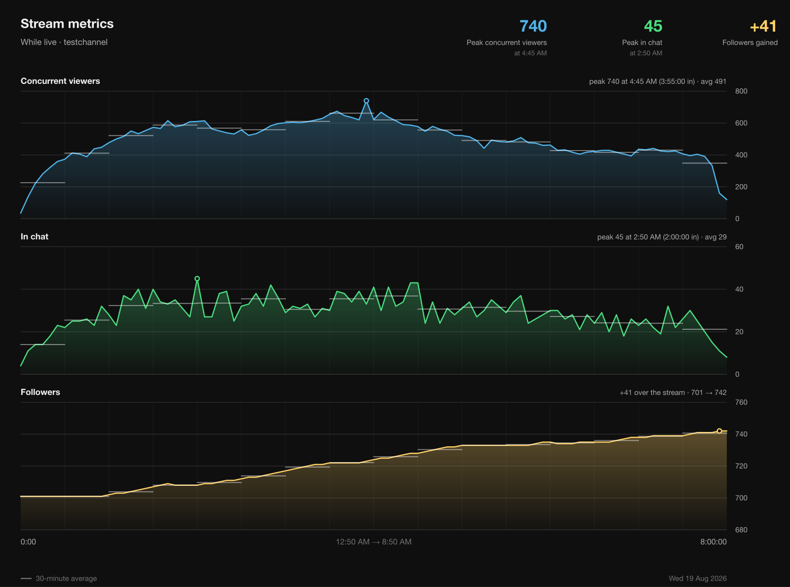
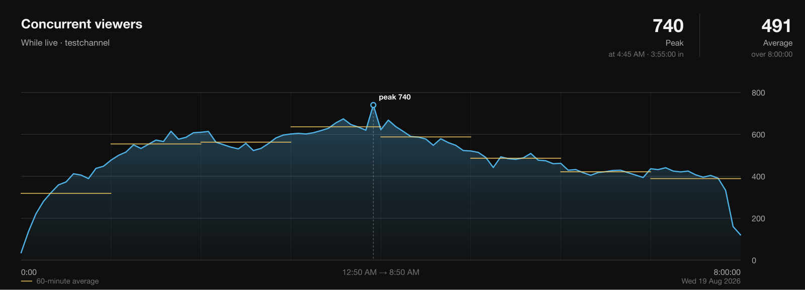
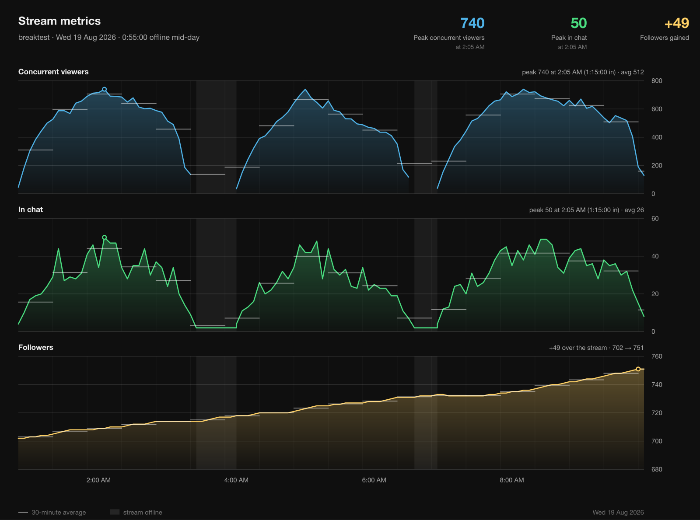

# Twitch Metrics

Poll a Twitch channel's **viewers, followers and chat size** on an interval into
a CSV, then chart it in the style of the YouTube Studio "Concurrent viewers"
graph.

The same poller [also runs against YouTube](#youtube) — concurrent viewers,
likes and subscriber count, into the same CSVs and the same charts.

**Python 3.9+ and nothing else.** No dependencies, no `pip install`, no
virtualenv needed — only the standard library. `urllib` for HTTP, `csv` for
storage, hand-built SVG for the charts.

That covers polling, charting and the Google Drive upload — Drive is plain REST
and its OAuth is plain form posts, so `urllib` handles both. The one addition is
the [daily report](#daily-report), which converts its charts to PNG and so wants
the `rsvg-convert` binary (`apt install librsvg2-bin`) — a system package, not a
Python dependency.


Polling all three metrics gives a panel each:



*Both generated from the synthetic fixtures in `tests/fixtures/`, so they
reproduce without credentials.*

### What it does

- Samples viewers, followers and chat size on one tick into `data/metrics_<channel>.csv`
- Records offline polls too, so a gap in the data means "not running" rather than "not streaming"
- Handles token refresh, rate limits, API outages and network loss without dying
- Charts a single broadcast or a whole calendar day, one metric or all three
- Degrades cleanly when a metric needs permissions you don't have
- Ships synthetic sample data so the charts work before you collect anything
- Also polls **YouTube** live viewers, likes and subscriber count, into the same CSV-and-chart pipeline
- Publishes each channel's daily graphs to its own S3 static website, on a timer

---

## Install

```
git clone https://github.com/bowermandw/twitch-stream-viewer-count.git
cd twitch-stream-viewer-count
python3 -m twitchmetrics --help
```

That's it — there is nothing to install, and no virtualenv is needed to run it.

Optionally put a `twitch-metrics` command on your PATH. Note that modern Pythons
(Homebrew, Debian, Ubuntu) are *externally managed* and will refuse a bare
`pip install`, so use a venv or pipx:

```
python3 -m venv .venv && .venv/bin/pip install -e .
.venv/bin/twitch-metrics --help
```

```
pipx install .          # if you have pipx
```

Either way **no dependencies are downloaded** — the install only creates the
entry point. If you'd rather not bother, `python3 -m twitchmetrics` is
equivalent everywhere and needs nothing. This README writes the short form for
readability; substitute whichever you use.

For servers, see [`deploy/README.md`](deploy/README.md) — requirements, running
it in the background, and how to handle the one step that needs a browser.

## Credentials

```
twitch-metrics setup
```

Walks you through registering a Twitch app, then **verifies the credentials
against the live API** before writing `.env` at mode 0600. If Twitch rejects
them, nothing is written and it tells you why.

<details>
<summary>What you'll do in the browser (about 2 minutes, once)</summary>

Twitch has no API for creating an app or reading back a secret, so this part is
manual.

1. Go to <https://dev.twitch.tv/console/apps/create> and log in.
   The dev console requires 2FA on the account; if you don't have it enabled it
   will make you set it up first.

2. Fill in the form:

   | Field | Value |
   |---|---|
   | **Name** | Anything unique across Twitch, e.g. `testchannel-viewer-log` |
   | **OAuth Redirect URLs** | `http://localhost:3000` — required, and used only by `twitch-metrics auth` |
   | **Category** | `Analytics Tool` |
   | **Client Type** | `Confidential` |

3. Click **Create**, then **Manage** on the new app.

4. Copy the **Client ID**. Click **New Secret** and copy that too — it is shown
   only once, and generating another invalidates the previous one.

Non-interactive, for servers:

```
twitch-metrics setup --client-id XXXX --client-secret YYYY
```
</details>

---

## Polling

```
twitch-metrics poll testchannel
```

```
testchannel  LIVE     viewers      51  followers      751  chat     4
```

One row per tick in `data/metrics_<channel>.csv`:

```
timestamp_utc,is_live,viewer_count,follower_count,chatter_count,title,game,started_at,stream_id
```

Followers and chat size are recorded **even when the channel is offline** —
people follow and bots sit in chat between streams — while `viewer_count` is
blank. Only `is_live` marks a broadcast.

```
twitch-metrics poll testchannel --once           # one sample
twitch-metrics poll testchannel --no-chatters    # skip chat size
twitch-metrics poll testchannel --viewers-only   # viewers alone
twitch-metrics poll testchannel --interval 60    # every minute
```

### Changing the interval

No code edit needed. Either flag it per run, or set it once in `.env`:

```
TWITCH_INTERVAL=60
```

Precedence is **`--interval` > `TWITCH_INTERVAL` > 300 seconds**, with a minimum
of 10. A value that isn't a number is reported rather than silently ignored,
since a typo in a service file would otherwise poll at the wrong rate unnoticed.

Samples land on wall-clock boundaries, so 60 gives you :00, :01, :02 and 300
gives :00, :05, :10.

Twitch's rate limit is 800 points per minute. Polling three metrics every 60
seconds for one channel uses 3 — even a dozen channels at that rate is nowhere
near it. The real cost is file size: one channel at 60s writes about 1,440 rows
a day, roughly 100 MB a year, against 20 MB at the default.

### Running it in the background

`Ctrl-C`, `SIGTERM` and `SIGHUP` all shut down cleanly — the poller finishes the
current sample, writes a summary and exits 0, without waiting out the rest of
the interval. That makes it safe under a service manager.

```
tmux new -s twitch                                    # quick: Ctrl-B D to detach
sudo systemctl enable --now twitch-metrics@testchannel   # permanent
```

### Several channels at once

Each channel keeps its own CSV and log, so pollers run side by side without
interfering. The systemd unit is a template — the name after the `@` is the
channel:

```
sudo systemctl enable --now twitch-metrics@testchannel
sudo systemctl enable --now twitch-metrics@prgskidmark
```

The only shared state is the cached tokens. Those are written atomically, and
refreshes are serialised with a file lock, because Twitch rotates the refresh
token on use.

`youtube-metrics@.service` is the same idea for the YouTube poller, and runs
alongside rather than instead — it shares no files with the Twitch instances.

The units and recipes for tmux, nohup, cron, launchd and logrotate are in
[`deploy/`](deploy/).

### What each metric needs

| Metric | Token | Works for |
|---|---|---|
| Viewers | app | any channel |
| Followers | app | any channel |
| Chat size | user + `moderator:read:chatters` | channels you moderate |

Chat size is the only one needing a browser login, so it degrades rather than
blocking: without a usable token, or on a channel you don't moderate, the column
is left blank and the other two carry on. After three consecutive failures it
stops asking, so a permission change mid-run doesn't fill the log with errors.

### The CSV always appends

Both formats open in append mode and write the header only when the file is
empty, so stopping and restarting — minutes or days later — continues the same
file. Nothing is overwritten, and no marker is written at the join.

A gap in the timestamps is therefore the only record that polling stopped.
`graph` infers one when the interval exceeds 2.5× the median and treats the
samples either side as separate broadcasts. `--date` ignores that and takes the
whole day.

---

## YouTube

```
twitch-metrics youtube testchannel
```

Samples a YouTube channel's **concurrent viewers, likes and subscriber count**
into `data/youtube_<channel>.csv`, on the same interval and in the same shape as
the Twitch poller, so `graph` charts it with no extra flags.

The channel is the `@name` from its URL — `youtube.com/@testchannel` means
`testchannel` — or a raw `UC…` channel id. It is resolved from
`YOUTUBE_CHANNEL` rather than `TWITCH_CHANNEL`, because a creator's handle on
the two platforms need not match.

### The key

One API key, no browser login: both metrics are public, so there is nothing to
authorize.

1. Create a key at [console.cloud.google.com/apis/credentials](https://console.cloud.google.com/apis/credentials)
2. Enable **YouTube Data API v3** for the same project
3. Put it in `.env` as `YOUTUBE_API_KEY=…`

Every Twitch command keeps working without it.

### Why there is no chat size

Twitch's chat-size equivalent here is `totalChatCount`, and it lives on the
`liveBroadcasts` resource of the Live Streaming API, which requires OAuth as the
channel's own Google account. An API key cannot reach it, so the column does not
exist rather than being present and always blank.

### Finding the live broadcast

YouTube has no "is this channel live" endpoint. The concurrent viewer count
hangs off a *video*, so the live video has to be found first — and how it is
found matters, because every request is billed against a quota.

`search.list(eventType=live)` is the direct route and is capped at **100 calls a
day**, where a five-minute interval needs 288. So the poller walks the channel's
uploads playlist instead: a broadcast scheduled ahead of time sits there as
`upcoming` and flips to `live` when it starts.

| Per sample | Endpoint | Units |
|---|---|---|
| subscriber count | `channels.list` | 1 |
| recent uploads | `playlistItems.list` | 1 |
| broadcast state, viewers and likes | `videos.list` | 1 |

Quota is charged per *call*, not per *part*, so asking `videos.list` for
`statistics` alongside `liveStreamingDetails` gets the like count for nothing.

Three units against a daily allowance of 10,000. The default interval is **60
seconds** — 4,320 units a day, which leaves room for a second channel but not a
third. Set `YOUTUBE_INTERVAL` (or `--interval`) to stretch it further; anything
under 60 seconds is refused rather than quietly overspending, and the poller
logs its projected daily usage at startup:

```
start    Theme Park Giant (UCzRcwXQzROFtWD764gz5KSQ)
start    3 units per sample, about 4,320 of 10,000 quota units a day
```

`YOUTUBE_INTERVAL` is deliberately separate from `TWITCH_INTERVAL`: an interval
picked over there is a rate-limit decision, and reusing it here would silently
turn it into a quota one.

To see what the playlist actually knows:

```
twitch-metrics youtube testchannel --list-recent
```

```
Theme Park Giant  — 15 most recent upload(s)

  upcoming  2026-08-30 19:00         —  Rope Drop at Magic Kingdom
  live      2026-08-24 18:02     2,413  Every Ride at Epcot, Worst to Best
  none      2026-08-22 18:00         —  Why Tron Broke Down Again
```

If a broadcast is genuinely live but nothing here says `live`, the playlist is
lagging for this channel — `--search` switches discovery to `search.list` to
confirm it. That mode is only usable at intervals of 864 seconds or more, and
the command says so rather than quietly blowing the allowance.

### What each number is worth

**`concurrentViewers`** is the good one — exact, and it moves every minute. It
is absent for the first moments of a broadcast and on a channel that hides it,
so a live sample with a blank viewer count is normal.

**`likeCount`** is exact and cumulative for the broadcast, so it only ever
climbs. A useful proxy for how a stream is landing, and free to collect.

**`subscriberCount`** is rounded to **three significant figures** by YouTube
policy, and there is no way around it: Studio's exact figure comes from an
internal number that no public API exposes. At 17k that rounding is a step of
100, so the series sits perfectly flat across a single broadcast and only moves
every week or two. Worth keeping as a slow trend, not worth charting intraday:

```
twitch-metrics graph data/youtube_testchannel.csv --only viewers
```

(The YouTube *Analytics* API does give exact `subscribersGained` and
`subscribersLost` per day — but no absolute total, and it needs OAuth as the
channel's own Google account.)

Charting works exactly as it does for Twitch, via the file path:

```
twitch-metrics graph data/youtube_testchannel.csv --open
```

Viewers, likes and subscribers each get a panel, or name one with `--only`.
Likes and subscribers share the followers axis treatment — not zero-based, since
a 10,000-subscriber step is invisible on a 0–1,240,000 scale.

---

## Graphing

```
twitch-metrics graph testchannel --open
```

Reads `data/metrics_<channel>.csv` (falling back to `viewers_<channel>.csv`) and
writes `charts/chart_<channel>_metrics.svg`. It also prints a text summary, so
you get the numbers without opening anything.

### Peak timing

Every peak reports **when** it happened — wall-clock first, elapsed second
(`peak 740 at 4:45 AM (3:55:00 into the stream)`) — in the header, the panel
captions and the text summary. The moment is marked on the curve with a dot and
a dashed drop-line.

Follower tiles show no time, because that number is the change across the window
rather than a moment.

### Block averages

Instead of one average line across the whole chart, a short line sits over each
block at that block's average, with a faint divider at each boundary.

```
twitch-metrics graph testchannel               # 30-minute blocks (default)
twitch-metrics graph testchannel --bucket 60   # hourly
twitch-metrics graph testchannel --no-buckets  # just the curve
```



### One metric, or all three at once

Each panel gets its own axis, because the three live on completely different
scales. Followers deliberately **do not** use a zero-based axis: on a 0–800
scale, a 40-follower gain is an invisible flat line. The panel spans the actual
range instead.

`--composite` overlays all three, each normalised to its own range with the real
range in the legend:


```
twitch-metrics graph testchannel --composite
twitch-metrics graph testchannel --only chatters
twitch-metrics graph testchannel --viewers-only
```

### Charting one day

```
twitch-metrics graph testchannel --date 2026-08-22
twitch-metrics graph testchannel --date today
twitch-metrics graph testchannel --list-days
```

This charts a **calendar day** rather than a single broadcast: from the first
live sample of that day to the last, keeping any offline stretch in between so
the day reads continuously.



That day was three sittings with two breaks. Three things to notice:

- The **viewers** line breaks over each gap rather than drawing a straight
  segment across it, because there is genuinely no viewer count while offline.
- **Followers** run unbroken straight through — people follow between streams,
  and that is real data.
- Offline stretches are **shaded**, and the x-axis switches to clock times.

Dates match in **local time**, which is the day you mean when you type one, even
though the CSV stores UTC.

Without `--date`, the same file splits at each break:

```
$ twitch-metrics graph breaktest --list-sessions
4 broadcast(s) in metrics_breaktest.csv:
  [0] Tue 18 Aug 5:05 AM    0:45:00  peak    180  avg    109  (10 samples)
  [1] Wed 19 Aug 12:50 AM    2:30:00  peak    740  avg    528  (31 samples)
  [2] Wed 19 Aug 4:00 AM    2:30:00  peak    740  avg    464  (31 samples)
  [3] Wed 19 Aug 6:55 AM    3:00:00  peak    740  avg    538  (37 samples)

$ twitch-metrics graph breaktest --list-days
2 day(s) with live data in metrics_breaktest.csv:
  2026-08-18    0:45:00  peak    180  10 samples
  2026-08-19    9:05:00  peak    740  112 samples   (0:55:00 offline mid-day)
```

Use `--session` for one sitting, `--date` for a whole day. They can't be
combined, since they select different things.

---

## Daily report

One command charts every channel you are polling — on both platforms — and
publishes each one to its own website. A systemd timer runs it at 17:00; see
[`deploy/`](deploy/).

```
twitch-metrics daily                          # today, every polled channel
twitch-metrics daily --dry-run                # render the charts, publish nothing
twitch-metrics daily --date yesterday         # backfill a day
twitch-metrics daily testchannel           # just this one
twitch-metrics daily --list-channels          # who's in, and what today looks like
twitch-metrics daily --no-trends              # skip the multi-day charts
```

```
[…] start    aws account 123456789012 as twitch-metrics
[…] start    daily report for 2026-08-24 — 2 channel(s) from the enabled systemd units
[…] testchannel  twitch   28 KB -> chart_testchannel_twitch_2026-08-24.svg
[…] testchannel  youtube  11 KB -> chart_testchannel_youtube_2026-08-24.svg
[…] testchannel  twitch   -> http://tm-testchannel-<suffix>.s3-website-<region>.amazonaws.com/twitch/2026-08-24.svg
[…] testchannel  youtube  -> http://tm-testchannel-<suffix>.s3-website-<region>.amazonaws.com/youtube/2026-08-24.svg
[…] testchannel  page rebuilt from 3 day(s): http://tm-testchannel-<suffix>.s3-website-<region>.amazonaws.com
[…] skip     prgskidmark twitch — offline all day, nothing to chart
[…] stop     1 published, 1 dark in 4.1s
```

A channel polled on both platforms gets a graph each; one polled on only Twitch
gets one graph, and that is **not** a failure — a platform you don't stream on
is not a broken poller.

### Which channels

The list comes from the pollers you have enabled, either platform, so adding a
channel to the report is just `systemctl enable twitch-metrics@thatchannel` or
`youtube-metrics@thatchannel`. A channel with both is one channel, not two. In
precedence order:

| Source | |
|---|---|
| positional arguments, or `--channel` (repeatable) | `daily a b` |
| `TWITCH_DAILY_CHANNELS` in the environment or `.env` | `a,b` or `a b` |
| enabled `twitch-metrics@*` and `youtube-metrics@*` instances | the normal case |
| `systemctl list-units` | fallback: started but not enabled |
| nothing found | **exits 1** — a daily job going quiet is not success |

Enabled rather than *running* on purpose. A channel you enabled whose poller
died at 03:00 is exactly what the report should shout about; ask "what's
running?" and that channel drops off the list and the job goes green, which
disables the alarm at the moment it matters.

### A day off is not a failure

The poller records followers even when a channel is offline, so "didn't stream"
and "poller wasn't running" look similar in the CSV. They are told apart,
because otherwise every day you take off turns `systemctl status` red and within
a fortnight nobody reads it:

| That platform's CSV for that day | Means | Result |
|---|---|---|
| has live samples | there's a chart to draw | rendered and published |
| has rows, none live | you didn't stream | **skipped, exit 0** |
| has no rows at all, and the day is **today** | the poller isn't running | **failure, exit 1** |
| has no rows at all, on an **older** date | collection started later | **skipped, exit 0** |
| doesn't exist | you don't stream on that platform | **skipped, exit 0** |

The last two are why backfilling a week is quiet: a CSV that simply doesn't
reach back that far isn't a fault, and neither is a platform you have never
polled. Only silence *today* means something is broken.

Exit codes are 0 and 1 only. A failure on one channel doesn't stop the others,
and a platform that failed is still reported even when its sibling published
fine — every channel is attempted, and the last log line is always the summary.

## The website

Each channel gets an S3 bucket serving one page: today's graphs displayed,
earlier days as links.

```
twitch-metrics s3 --setup testchannel   # create and configure the bucket
twitch-metrics s3 --check testchannel   # prove the credentials, name the bucket
twitch-metrics s3 --list                   # every channel that has one
twitch-metrics s3 testchannel --url     # just the URL, for scripts
```

```
http://tm-<channel>-<suffix>.s3-website-<region>.amazonaws.com
```

The address is written as a template on purpose. The site is public-read — that
is what makes it a website — so the suffix is the only thing keeping it
unlisted, and a real one does not belong in a repo that isn't private. Ask for
your own with `s3 --url`; it is recorded in `data/.s3_buckets.json`, which is
gitignored.

The bucket holds nothing but the page and the charts:

```
index.html                   today, rebuilt every run
trends.html                  the multi-day charts
titles.json                  what each day's stream was called
combined/2026-08-24.svg      both platforms on one axis — leads the page
twitch/2026-08-24.svg
youtube/2026-08-24.svg
twitch/2026-08-23.svg        …
trends/peaks-twitch.svg      no date: replaced every run
trends/typical-youtube.svg
```

### Trends

`index.html` answers *what happened today*. Everything comparative lives on a
second page, linked from under the date:

- **Peak viewers by day**, the last ten days as one bar each, Twitch and
  YouTube charted separately.
- **Half-hour averages, today vs before**, one bar per day per half hour of the
  clock — today beside each of the previous five days, oldest to newest.

The second one is the reason there is a separate module rather than another
function in `chart.py`. Every graph on the front page buckets by time *since the
stream started*, which is the right axis for reading one broadcast and the wrong
one for comparing days: it would lay a stream that began at 6pm over one that
began at 8pm and call both blocks "the first half hour". The Trends charts
bucket by the **clock**, so 8:30pm is 8:30pm on all six days.

Each day keeps its own bar rather than being folded into a five-day mean. An
average hides its own spread — one freak evening drags "normal" up and nothing
on the chart says so — whereas five bars show you immediately whether today is
outside the range or in the middle of it.

A day you didn't stream is a gap, never a zero, for the same reason the combined
chart leaves holes: 0 viewers is a real reading a stream that has just gone live
genuinely has, and drawing a day off the same way would invent a catastrophe out
of a rest. A channel that spans more than twelve hours has its busiest twelve
shown, and the chart says so rather than quietly cropping.

The charts have no date in their key and are replaced on every run — they
describe where the channel is now, not what happened on a particular day. The
page is still built from a **listing of the bucket**, like `index.html`, so it
only ever links a chart that is actually there, and the front page's link only
appears once there is something to link to.

Ten days and five are `--peak-days` and `--compare-days`; the half-hour width is
the same `--bucket` the per-day charts use.

### Both platforms on one chart

When a channel streamed on more than one platform that day, the page leads with
a chart putting every platform's concurrent viewers on **one shared axis**,
plus a dashed line for the combined total — the number that answers "how many
people were watching at once, anywhere", which neither per-platform panel does.

Deliberately not normalised the way `graph --composite` is. There the point is
to compare the *shapes* of metrics living on different scales; here the whole
question is how the platforms compare in size, and scaling each to its own
range would answer it backwards — 50 viewers on Twitch and 500 on YouTube would
draw two curves of equal height.

Two things it is careful about, because both would otherwise lie:

- **Missing is not zero.** A stream that has just gone live really does have 0
  viewers, so "no sample" is drawn as a break in the line, never as a drop to
  the floor. A poller sampling a few seconds off the minute is carried across;
  a real outage is left as a hole.
- **The total waits for everyone.** The dashed line only appears where *every*
  platform has a reading. Before the second poller was started, a total built
  from whichever happened to be running would have undercounted while looking
  authoritative.

A channel that streamed on only one platform that day gets no combined chart —
it would trace the single platform's line exactly.

`index.html` is rebuilt from a **listing of the bucket**, not from anything kept
locally, so a run after a fortnight's gap still produces a correct index, and a
chart you upload by hand appears in it.

The stream's title sits under the date at the top. It is the one thing a listing
cannot supply, so it is kept in `titles.json` beside the charts rather than
handed in by the report — otherwise `s3 --publish-index` on its own would
quietly produce a page with the titles missing. The two platforms almost always
name the same broadcast differently, so **Twitch's title wins**, with YouTube as
a fallback for a channel that only streams there.

The name ends in ten random characters. Partly because bucket names are global
and `tm-testchannel` may already belong to a stranger; mostly because the
channel name is guessable and those characters are the only thing standing
between a stranger and the page. They can't be recomputed, so the name is
recorded in `data/.s3_buckets.json` — back that file up.

SVG, not PNG. A browser renders it natively, sharper at any zoom and about a
tenth the size, which also means the whole pipeline needs no `rsvg-convert` and
no font package. `png.py` is still there if you want a PNG by hand.

> **HTTP only.** S3 website endpoints do not serve TLS. Putting CloudFront in
> front is how you get HTTPS and a real domain; both are deliberately out of
> scope here.

> **Unlisted, not private.** The bucket is public-read — that is what makes it
> a website — so anyone with the address can open it, and it is only the address
> that keeps it quiet. Nothing links to it and the ten random characters in the
> name are not worth searching, but treat the URL itself as the secret: don't
> commit it. `docs/local/` is gitignored for exactly that. If you need real
> access control, that is CloudFront with signed URLs, and a different design.

### Setting up AWS

`pip install boto3` — or `pip install -e '.[aws]'`. It is imported lazily, so
the pollers and `graph` never need it and the CLI works in full without it.

Two things to do once, by hand:

**1. An IAM user** with programmatic access, and this policy. Scoping it to
`tm-*` means a bug here cannot touch anything else in the account:

```json
{
  "Version": "2012-10-17",
  "Statement": [
    { "Effect": "Allow",
      "Action": ["s3:CreateBucket", "s3:PutBucketPolicy", "s3:PutBucketWebsite",
                 "s3:PutBucketPublicAccessBlock", "s3:GetBucketLocation"],
      "Resource": "arn:aws:s3:::tm-*" },
    { "Effect": "Allow", "Action": ["s3:PutObject"], "Resource": "arn:aws:s3:::tm-*/*" },
    { "Effect": "Allow", "Action": ["s3:ListBucket"], "Resource": "arn:aws:s3:::tm-*" },
    { "Effect": "Allow", "Action": ["s3:GetAccountPublicAccessBlock"], "Resource": "*" }
  ]
}
```

The last statement is the only one that can't be scoped to a bucket, because
it reads an **account-wide** setting. It is read-only and is what lets `--setup`
say "account-level Block Public Access is on" instead of reporting a bare
`AccessDenied`. Omit it and setup still works; the diagnosis just gets worse.

Put the key in `.env` as `AWS_ACCESS_KEY_ID` / `AWS_SECRET_ACCESS_KEY`, or leave
them unset and let boto3 find `~/.aws/credentials` or an instance role. A machine
that only runs `daily` needs just the last two statements.

> **If this machine can reach more than one AWS account, pin it.** Set
> `AWS_ACCOUNT_ID` in `.env` and nothing is created or uploaded unless the
> credentials resolve to that account. A laptop with SSO profiles for a dozen
> accounts — several of them administrator — resolves boto3's chain to whatever
> `AWS_PROFILE` happens to name, and this turns the wrong one into a refusal
> instead of a bucket in someone's production account. Find the id with
> `aws sts get-caller-identity`, or from `s3 --check`'s first log line.

**2. Turn off account-level Block Public Access** — *S3 → Block Public Access
(account settings) → Edit → clear all four*. This is a different setting from the
per-bucket one `--setup` handles, and AWS applies whichever is **more
restrictive**, so leaving it on makes the bucket policy fail with `AccessDenied`
no matter what this tool does. `--setup` checks it first and says exactly that.

Then, per channel:

```
twitch-metrics s3 --setup testchannel
```

which creates the bucket, clears its Block Public Access, applies a public-read
policy for `s3:GetObject`, turns on website hosting and prints the URL. It is
idempotent — a channel that already has a bucket is left alone, so re-running
after a half-finished setup doesn't strand a second one.

A bucket policy rather than an ACL, because new buckets have Object Ownership
set to *bucket owner enforced*, which disables ACLs outright.

### Google Drive is retired

The daily report used to upload PNGs to Google Drive. `drive.py`, `driveoauth.py`
and `commands/drive_cmd.py` are still in the tree and still covered by the tests,
but the `drive` subcommand is no longer registered — restoring it is one line
back in `cli.COMMANDS`.

---

## Other lookups

Each takes the channel as its first argument, falling back to `TWITCH_CHANNEL`
then the built-in default, and accepts a login, an `@handle`, or a numeric ID.

### Accounts

```
twitch-metrics users prgskidmark
twitch-metrics users ign prgskidmark testchannel   # batched, up to 100
twitch-metrics users 35616747 --by-id
```

Twitch omits unknown logins rather than erroring, so the command reports which
of the names you asked for came back empty.

`view_count` is still returned by this endpoint but always contains `0` — Twitch
retired lifetime view counts in 2022 and dropped the field from their docs
without removing it from the API. It's labelled deprecated rather than shown as
if it meant something.

### Followers

```
twitch-metrics followers testchannel                 # just the count
twitch-metrics followers testchannel --recent 10     # newest, with how long ago
twitch-metrics followers testchannel --list          # everyone, paged
twitch-metrics followers testchannel --check someone # do they follow, and since when
```

The count uses the app token and works for **any** channel:

```
$ twitch-metrics followers ign
IGN — 308,332 followers
```

Seeing *who* follows is different — Twitch returns `total` to anyone but
withholds the `data` array unless the token belongs to the broadcaster or a
moderator and carries `moderator:read:followers`.

### Chatters

```
twitch-metrics chatters testchannel
twitch-metrics chatters testchannel --list
```

```
testchannel — 3 people in chat
  (as moderator prgskidmark)
```

You don't pass a moderator ID: Twitch requires it to match the token's own user,
so it's read from the token rather than left as something to get wrong.

The count includes bots and includes whoever is making the request, so it has a
floor rather than reaching zero.

---

## User authorization

Most commands use an **app access token** (client credentials), which represents
the application and needs no login. Chat size and follower *names* need a **user
access token** representing a person:

```
twitch-metrics auth
```

Opens Twitch, you approve, and it catches the redirect on `http://localhost:3000`
— the redirect URL registered during setup. Sign in as the account that
moderates the channel.

```
twitch-metrics auth --status    # who it's for, scopes, time left
twitch-metrics auth --force     # log in again, e.g. as someone else
twitch-metrics auth --revoke    # revoke and delete it
twitch-metrics auth --manual    # headless: paste the code back
```

### On a machine with no browser

Authorizing from a server needs one extra step, because the redirect to
`http://localhost:3000` resolves to whichever machine the *browser* is on.

**SSH tunnel** — forwards your desktop's port 3000 to the server's, so the
normal flow works unchanged. On your desktop:

```
ssh -L 3000:localhost:3000 user@your-server
```

Leave that open, and in it run:

```
python3 -m twitchmetrics auth --no-browser
```

Paste the printed URL into your desktop browser, approve, and the redirect
travels back down the tunnel to the waiting listener. The tunnel is only needed
for this one step.

**Or skip the tunnel** with `--manual`, which prints the URL and waits for you
to paste the redirect back:

```
twitch-metrics auth --manual
```

The browser will fail to reach `localhost:3000` — expected — but the address bar
still holds `?code=...`. Paste that whole URL at the prompt. State is verified,
so the CSRF check survives the detour.

Full server notes, including copying an existing token up instead, are in
[`deploy/README.md`](deploy/README.md).

The token lasts about four hours and refreshes itself from the stored refresh
token, so the browser step happens once. Requesting a new scope carries the
already-granted ones along, so adding one doesn't break another command.

---

## Test data

To work on the charts without waiting for a real 8-hour stream:

```
twitch-metrics testdata testchannel
twitch-metrics graph testchannel --open
```

The three metrics are generated as one **correlated** system rather than
independently: chat size tracks viewers above a bot floor, and followers accrue
faster while more people are watching, with occasional unfollows so the line
isn't suspiciously monotonic. The viewer curve ramps, bumps mid-stream, jitters
with correlated rather than random noise, declines slowly and drops sharply at
the end.

```
twitch-metrics testdata testchannel --hours 4 --peak 2000 --interval 60
twitch-metrics testdata breaktest --break 2.5:40 --break 5:25
```

`--break H:M` inserts an offline gap M minutes long, H hours in — repeatable,
each restart taking a new `stream_id` the way Twitch issues one. That's what the
day chart above is generated from. The seed is fixed by default, so regenerating
gives identical data.

## Tests

```
python3 tests/smoke.py
```

423 checks over the committed fixtures — parsing, session detection, day
selection, gap handling, axis choice, path safety, rendering, CLI wiring,
channel discovery, bucket naming, the index page, the Drive query and
multipart builders, and the quota refusals that stop a mistyped YouTube interval
costing a day's data. It proves boto3 stays optional by running the CLI against
a `boto3.py` that refuses to import. It also covers adding a column to a CSV already on disk, which is
silently lossy if done wrong. No network, no credentials, no tokens. It won't
catch Twitch or YouTube changing an API contract; only regressions in this
code.

---

## Layout

```
twitchmetrics/          the package
  config.py             paths, .env, channel resolution
  auth.py               app access token
  useroauth.py          user access token (browser flow)
  api.py                Helix endpoint wrappers
  youtube.py            YouTube Data API wrappers
  runloop.py            the sampling loop both pollers share
  s3.py                 the website: buckets, uploads, the index page
  retry.py              backoff shared by every destination
  drive.py              Google Drive (retired, kept for reference)
  storage.py            CSV read and append
  chart.py              SVG rendering
  png.py                SVG to PNG, via rsvg-convert
  driveoauth.py         Google access token (browser flow)
  drive.py              Drive v3 endpoint wrappers
  testdata.py           synthetic data model
  cli.py                subcommand dispatch
  commands/             one module per subcommand
data/                   samples, logs, cached tokens   (gitignored)
charts/                 generated SVGs                 (gitignored)
tests/fixtures/         synthetic sample data           (committed)
docs/                   README images
deploy/                 systemd units and server notes
```

`data/` and `charts/` can be redirected with `TWITCH_DATA_DIR` and
`TWITCH_CHARTS_DIR`, which is useful when the data belongs on a mounted volume.

`data/` holds the only irreplaceable thing here — charts regenerate from the
CSVs, and tokens can be re-fetched.

## Notes

- `viewer_count` is Twitch's live concurrent-viewer number and lags reality by
  about a minute. Treat it as approximate.
- Twitch's rate limit is 800 points/minute. Polling every 5 minutes uses a
  vanishing fraction of that, so a shorter interval is fine.
- YouTube is the opposite: a hard 10,000 units a day, resetting at midnight
  Pacific, so the interval there is a budget rather than a preference.
- Charts are SVG. To convert one by hand: `brew install librsvg` or
  `apt install librsvg2-bin`, then `rsvg-convert -w 1600 in.svg -o out.png`.
  That binary is the one thing `daily` needs installed, because it uploads PNGs;
  nothing else here uses it.
- On a minimal Debian with no fonts installed, `rsvg-convert` exits 0 and writes
  a PNG with the text missing. `apt install fonts-dejavu-core`, and eyeball the
  first upload once — no test can catch that.
